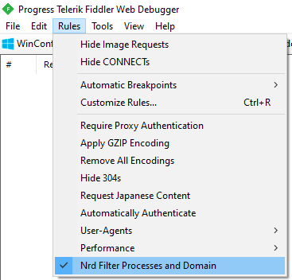

# Custom-FiddlerScript

Fiddler's default rules are stored in `C:\Users\xxx\Documents\Fiddler2\Scripts\CustomRules.js`

What's news?
- [RequestResponseTime](#RequestResponseTime)
- [Crawl Sequential URLs](#Crawl-Sequential-URLs)
- [Replay Sequential URLs](#Replay-Sequential-URLs)
- [Filter specific Processes and Domains](#Filter-specific-Processes-and-Domains)
- [Show Time-to-Last-Byte](#Show-Time-to-Last-Byte)
- [CopyTimers](#CopyTimers)
- [Call Sequences DELETE for Rest API with HTTP header](#Call-Sequences-DELETE-for-Rest-API-with-HTTP-header)
- [Clean Header Request & Response](#Clean-Header-Request-&-Response)
- ...


## RequestResponseTime


```javascript
public static RulesOption("&Show RequestResponseTime", "NREADY Labs")
var m_requestTimeOn: boolean = true;

public static BindUIColumn("RequestResponseTime", 180)

function RequestResponseTime(oS: Session) {
    if (oS.Timers != null) {
        return oS.Timers.ClientBeginRequest.ToString("HH:mm:ss.ffff") + " -> " + oS.Timers.ClientDoneResponse.ToString("HH:mm:ss.ffff");
    }
    return String.Empty;
}
```

## Crawl Sequential URLs


```javascript
public static ToolsAction("Crawl Sequential URLs", "NREADY Lab")

function doCrawl() {
    var sBase: String;
    var sInt: String;

    sBase = FiddlerObject.prompt("Enter base URL with ## in place of the start integer", "http://");
    sInt = FiddlerObject.prompt("Start At", "1");
    var iFirst = int.Parse(sInt);
    sInt = FiddlerObject.prompt("End At", "100");
    var iLast = int.Parse(sInt);

    for (var x = iFirst; x <= iLast; x++) {
        //Replace 's' with your HTTP Request. Note: \ is a special character in JScript
        // If you want to represent a backslash in a string constant, double it like \\ 
        var s = "GET " + sBase.Replace("##", x.ToString()) + " HTTP/1.0\r\n\r\n";
        var b = false;
        while (!b) {
            try {
                FiddlerObject.utilIssueRequest(s);
                b = true;
            } catch (e) {
                var iT = Environment.TickCount + 10000;
                FiddlerObject.StatusText = "Waiting 10 sec because we have too many requests outstanding...";
                while (iT > Environment.TickCount) { Application.DoEvents(); }
            }
        }
    }
}
```

## Replay Sequential URLs


```javascript
public static ToolsAction("Replay Sequential URLs", "NREADY Lab")

function doReplay() {
    var sBase: String;
    var sInt: String;

    sBase = FiddlerObject.prompt("Enter base URL", "http://");
    sInt = FiddlerObject.prompt("Times=", "1");
    var n = int.Parse(sInt);

    for (var i = 1; i <= n; i++) {
        var s = "GET " + sBase + " HTTP/1.1\r\n\r\n";
        var b = false;
        while (!b) {
            try {
                FiddlerObject.utilIssueRequest(s);
                b = true;
            } catch (e) {
                var iT = Environment.TickCount + 10000;
                FiddlerObject.StatusText = "Waiting 10 sec because we have too many requests outstanding...";
                while (iT > Environment.TickCount) { Application.DoEvents(); }
            }
        }
    }
}
```

## Filter Processes and Domain



Filter traffic with specific process and specific domain request. Declare the Rule option before *OnBeforeRequest()* function:

```javascript
public static RulesOption("&Filter Processes and Domain", "NREADY Labs")
var m_filterOn: boolean = true;
```

Inside *OnBeforeRequest()*:

```javascript
if (m_filterOn) {
    oSession["ui-hide"] = "true";
    // Some common processes:  IE - iexplore.exe; chrome - chrome.exe, MS Edge = msedge, IIS Express - iisexpress.exe, Powershell - powershell.exe
    // List of processes to filter on
    var processlist = ["chrome", "msedge", "iisexpress", "powershell"];
    // List of domain names to filter on
    var host = ["localhost", "nready.net"];
    for (var j = 0; j < processlist.length; j++) {
        if (oSession.LocalProcess.Contains(processlist[j])) {
            for (var i = 0; i < host.length; i++) {
                if (oSession.HostnameIs(host[i])) {
                    oSession["ui-hide"] = null;
                }
            }
        }
    }
}
```

## Show Time-to-Last-Byte

Show the duration between the start of Request.Send and Response.Completed in Milliseconds with color in red, yellow or orange.


```javascript
public static RulesOption("&Show Time-to-Last-Byte", "NREADY Labs")
var m_ShowTTLB: boolean = true;
```

Inside *OnBeforeResponse()*

```javascript
if (m_ShowTTLB) {
    oSession["ui-customcolumn"] = oSession.oResponse.iTTFB + "/" + oSession.oResponse.iTTLB + "ms " + oSession["ui-customcolumn"];

    if (oSession.oResponse.iTTLB >= 1000) { oSession["ui-backcolor"] = "yellow"; }
    if (oSession.oResponse.iTTLB >= 3000) { oSession["ui-backcolor"] = "orange"; }
    if (oSession.oResponse.iTTLB >= 10000) { oSession["ui-backcolor"] = "red"; }
}
```

## CopyTimers


```javascript
public static ContextAction("CopyTimers")

function CopyTimers(oSessions: Fiddler.Session[]) {
    if (null == oSessions) {
        MessageBox.Show("Please select sessions to copy timers for.", "Nothing to Do");
        return;
    }
    var s: System.Text.StringBuilder = new System.Text.StringBuilder();
    for (var x = 0; x < oSessions.Length; x++) {
        s.AppendFormat("ClientConnected {0}\nClientDoneRequest {1}\nServerConnected {2}\nServerGotRequest {3}\nServerBeginResponse {4}\nServerDoneResponse {5}\nClientBeginResponse {6}\nClientDoneResponse {7}\r\n",
            oSessions[x].Timers.ClientConnected,
            oSessions[x].Timers.ClientDoneRequest,
            oSessions[x].Timers.ServerConnected,
            oSessions[x].Timers.ServerGotRequest,
            oSessions[x].Timers.ServerBeginResponse,
            oSessions[x].Timers.ServerDoneResponse,
            oSessions[x].Timers.ClientBeginResponse,
            oSessions[x].Timers.ClientDoneResponse
        );
    }
    Utilities.CopyToClipboard(s.ToString());
    // MessageBox.Show("Done.");
    FiddlerObject.StatusText = "Coppied ...";
}
```

## Call Sequence DELETE for Rest API

Use for Sequence call Detele for Restful API with header got from **Session[]**. The **Session[]** is from ContextMenu action on any request that we choice


```javascript
public static ContextAction("Sequence DELETE")

function Seq_DELETE(arrSess: Session[]) {
    var oRH = '';
    var headerBuilder: System.Text.StringBuilder = new System.Text.StringBuilder();
    var sBase: String;
    var sInt: String;
    var sAuth: String;
    var sCookie: String;
    var baseURL = '';
    var baseAuthorization = '';
    var baseCooki = '';
    for (var i: int = 0; i < arrSess.Length; i++) {
        baseURL = arrSess[i].fullUrl;
        baseAuthorization = arrSess[i].oRequest["Authorization"];
        baseCooki = arrSess[i].oRequest["Cookie"];
    }
    sBase = FiddlerObject.prompt("Base URL with ## in place of the start integer", baseURL);
    sInt = FiddlerObject.prompt("Start At", "1");
    var iFirst = int.Parse(sInt);
    sInt = FiddlerObject.prompt("End At", "100");
    var iLast = int.Parse(sInt);
    sAuth = FiddlerObject.prompt("Authorization", baseAuthorization);
    sCookie = FiddlerObject.prompt("Cookie", baseCooki);
    for (var x = iFirst; x <= iLast; x++) {
        headerBuilder.AppendFormat("DELETE {0} HTTP/1.1\r\nAuthorization: {1}\r\nCookie: {2}\r\n\r\n",
            sBase.Replace("##", x.ToString()),
            sAuth,
            sCookie);
        var b = false;
        while (!b) {
            try {
                FiddlerObject.utilIssueRequest(headerBuilder);
                b = true;
            } catch (e) {
                //	var iT = Environment.TickCount + 2000;
                MessageBox.Show(e.ToString());
                //FiddlerObject.StatusText = e.ToString();// "Waiting 2 sec because we have too many requests outstanding...";
                //	while (iT > Environment.TickCount) { Application.DoEvents(); }
            }
        }
    }
    MessageBox.Show("Done ...");
    FiddlerObject.StatusText = "Done ...";
}
```

## Clean Header Request & Response

```javascript
public static ContextAction("Clean Header Request & Response")

function doClean(arrSess: Session[]) {
    for (var i: int = 0; i < arrSess.Length; i++) {
        arrSess[i].utilDecodeResponse();
        var oRH = arrSess[i].oRequest.headers;
        oRH.RemoveRange(["Cookie",
            "Authorization",
            "User-Agent",
            "Accept"
        ]);
        oRH = arrSess[i].oResponse.headers;
        oRH.RemoveRange(["X-Powered-By",
            "Last-Modified",
            "Accept-Ranges",
            "Connection",
            "Server",
            "Cache-Control",
            "Date",
            "X-Cache",
            "Expires",
            "Age",
            "Access-Control-Allow-Origin",
            "X-Frame-Options",
            "X-XSS-Protection",
            "Keep-Alive"
        ]);
    }
    MessageBox.Show("Done");
}
```

# Documentation
- Refer to: http://fiddlerbook.com/Fiddler/dev/ScriptSamples.asp
- https://www.telerik.com/blogs/understanding-fiddlerscript
- https://blogs.msdn.microsoft.com/aaddevsup/2018/09/26/how-to-filter-fiddler-capture-traffic-using-host-name-and-process-name/


# Credit
- Nam Le, leqnam@live.com, https://nready.net
